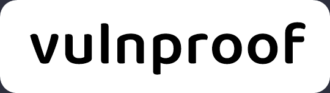

---
hide:
    - footer
    - toc
---

## 🎯 Mission Statement

{ align=right width=150 loading=lazy }

Application security has become a global risk as organizations are finding it challenging to secure their software infrastructure.

The mission of this wiki is to `accelerate the transition to secure software development` by doing the following:

-   Making secure development practices free and open for everyone to use and conveying them in such a way that is easy to understand and implement
-   Creating awareness among software developers so they take ownership of security
-   Developing a community that supports one another to achieve this mission

## 🚀 Follow us

